<p align="center">
    
</p>

## About Me

I am a programming and cybersecurity enthusiast. I currently work as an Offensive Cybersecurity Analyst at PwC, where I perform threat hunting and ensure compliance with internal security policies. My next challenge is to pass the OSCP exam so that I can finally call myself a hacker. I am passionate about expanding my knowledge every day, cybersecurity is constantly evolving, and it is essential to adapt and grow with it.

## 🛠️ My Skills

### Programming Languages


### Cybersecurity & Hacking Tools


### Methodologies
[](https://owasp.org/www-project-top-ten/)
[](https://owaspsamm.org/)
[](https://owasp.org/www-project-web-security-testing-guide/)
[](https://owasp.org/www-project-osstmm/)

## 📈 My GitHub Stats

<div style="display: flex; align-items: center;">
  
  
</div>


## 🔥 The Sith Code

```text
Peace is a lie, there is only passion.
Through passion, I gain strength.
Through strength, I gain power.
Through power, I gain victory.
Through victory, my chains are broken.
The Force shall free me.
```
